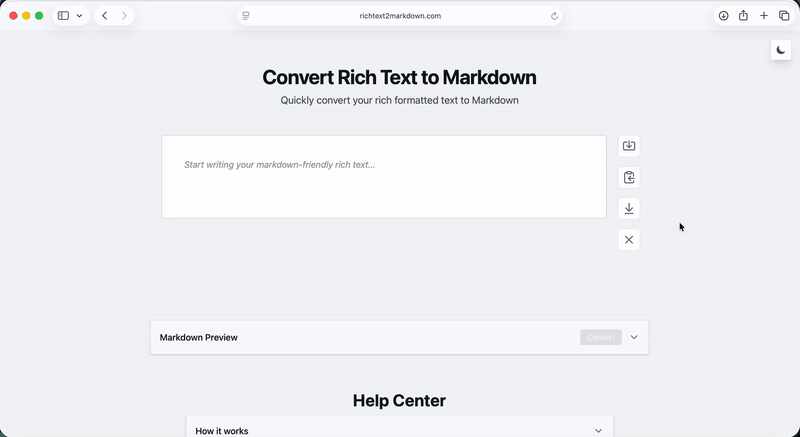

# Markdown Converter

A rich text to Markdown web app built with Angular 19, Tiptap, and Turndown.


## Demo



## Features

- Rich text editing (Tiptap)
- Markdown conversion (Turndown)
- Import from file, URL, and templates
- Export by clipboard copy or `.md` download
- Dark mode (system-aware + persisted preference)
- Accessibility checks and keyboard-focused UX
- Retry/backoff for URL imports

## Tech Stack

- Angular 19 (standalone components + signals)
- TypeScript
- Tailwind CSS
- Tiptap / ProseMirror
- Turndown + Marked
- Vitest + Playwright + axe-core
- ESLint + Prettier + Husky

## Project Structure

```text
markdown-converter/
├── e2e/
│   ├── accessibility.e2e.ts
│   ├── import-export.e2e.ts
│   ├── markdown-conversion.e2e.ts
│   └── theme-and-ui.e2e.ts
├── src/
│   ├── app/
│   │   ├── accordion/
│   │   ├── alert/
│   │   ├── guide/
│   │   ├── import-modal/
│   │   │   ├── import-modal.component.ts
│   │   │   └── import-modal.templates.ts
│   │   ├── markdown-preview/
│   │   ├── richtext/
│   │   ├── services/
│   │   │   ├── alert.service.ts
│   │   │   ├── analytics.models.ts
│   │   │   ├── analytics.service.ts
│   │   │   ├── editor.service.ts
│   │   │   ├── error-handler.service.ts
│   │   │   └── theme.service.ts
│   │   ├── utils/
│   │   │   └── retry.ts
│   │   ├── app.component.ts
│   │   ├── app.component.html
│   │   ├── app.config.ts
│   │   └── app.routes.ts
│   ├── main.ts
│   ├── styles.css
│   └── test-setup.ts
├── public/
├── .github/workflows/
├── angular.json
├── eslint.config.js
├── netlify.toml
├── package.json
├── playwright.config.ts
└── vitest.config.ts
```

## Getting Started

### Prerequisites

- Node.js 18, 20, or 22
- npm 9+ (or pnpm)

### Install

```bash
npm install
```

### Run locally

```bash
npm start
```

Open `http://localhost:4200`.

## Scripts

| Command                     | Description              |
| --------------------------- | ------------------------ |
| `npm start`                 | Start Angular dev server |
| `npm run build`             | Production build         |
| `npm run lint`              | Lint (`ng lint`)         |
| `npm test`                  | Unit tests (Vitest)      |
| `npm run test:watch`        | Unit tests in watch mode |
| `npm run test:coverage`     | Unit tests with coverage |
| `npm run test:e2e`          | Full Playwright suite    |
| `npm run test:e2e:chromium` | Chromium-only E2E        |
| `npm run test:e2e:ui`       | Playwright UI mode       |
| `npm run test:e2e:headed`   | Headed E2E run           |

## Testing

### Unit Tests

- Framework: Vitest (`vitest.config.ts`)
- Environment: `jsdom`
- Setup file: `src/test-setup.ts`

```bash
npm test
```

### E2E Tests

- Framework: Playwright (`playwright.config.ts`)
- Projects configured: Chromium, Firefox, WebKit, Mobile Chrome, Mobile Safari, Edge
- Accessibility checks include axe-core

```bash
npm run test:e2e
```

## Code Quality

- ESLint with Angular + TypeScript rules
- Prettier formatting in pre-commit hooks
- `no-warning-comments` blocks `TODO`, `FIXME`, `XXX` in committed TS code

### Comment policy

- Comments explain intent/tradeoffs/constraints, not obvious implementation details.
- Keep comments only for non-obvious behavior (framework quirks, polyfills, lint exceptions).
- Prefer explicit typing and self-documenting names over explanatory comment noise.

## Deployment

### Netlify

`netlify.toml` is configured for Angular build output:

```toml
[build]
  command = "ng build"
  publish = "dist/markdown_converter/browser"
```

### Manual

```bash
npm run build
```

Deploy the `dist/markdown_converter/browser` directory.

## Contributing

1. Create a branch
2. Implement changes
3. Run `npm run lint`, `npm test`, and relevant E2E tests
4. Open a PR

## License

MIT
